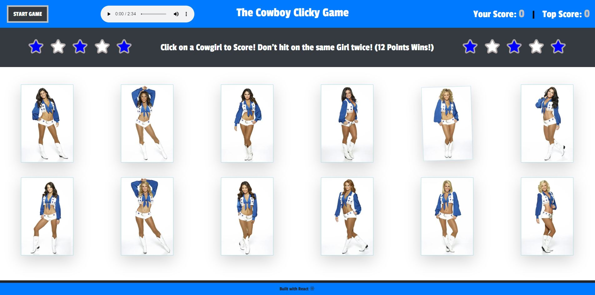

## Deployed on GitHub Pages <a href="https://pchiii.github.io/deployedclicky/" rel="nofollow"> here.</a>

CLICKY-GAME is built with React.js. The application is component based and able to keep track of change events using state, and updates to the page render dynamically and without page refresh.

This app is a game built with React. There are 12 different cheerleaders.  The objective is to click on each one for 1 point each, until youve clicked them all.  If you click on one twice before reaching 12 points, you lose.  If you make it all the way to 12 points, you win!!!
- - -
## Home Page:

- - -
## Technologies Used:
- React
- Bootstrap
- Google Fonts
- Font Awesome
- Animate Css

- - -
In the project directory, you can run:

### `npm start`

